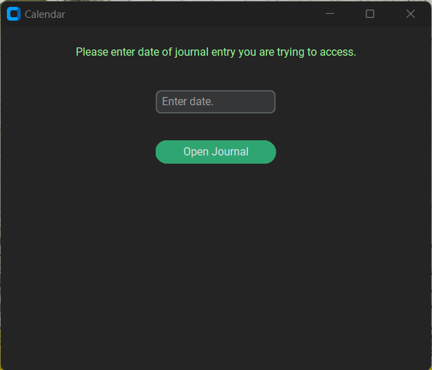

# journaling_app

As a way to keep my Python skills sharp, I began developing this journaling application for personal use. I have always had trouble deciding what to build, and when researching ideas, one of the most common answers was to "work on something that you care about". As a part-time writer in my current position, and someone who is looking to develop a habit of journaling, this seemed like the perfect project for me. 

There are currently two versions of the program based on which .py file you run. The first, scratch.py, opens a basic tkinter calendar. When selecting a day and pressing the button, a notepad opens up that is attached to that date. I researched further improvements to the functionality and UI/UX of the application, which led me to creating the second version, bootstrap.py.

After finding customtkinter on for another project, I decided to remove all tkkbootstrap items in my code and commit to customtkinter. It works similarly, as I have not found a way to populate the calendar yet, but is much easier to code with. I still plan on adding a password screen for accessing the journal, a more robust homepage, and  a SQLite backend to store the journal entries.

See the most up-to-date image of the app below:
